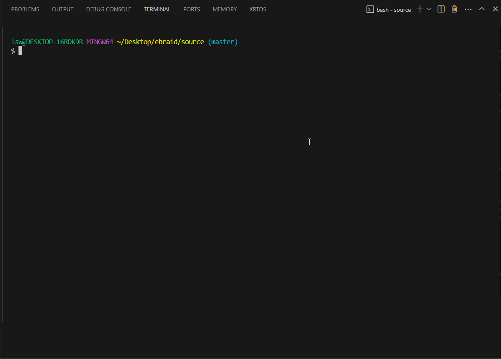

## 什么是lite-manager？
#### lite-manager是一个宏配置和管理工具，自动解决C语言项目中宏依赖的问题。 

1. 你是否讨厌过Cmake的管理十分繁杂，并且效率低下？
2. 你是否因为处理C语言中众多的宏而持续痛苦？
3. 你是否一直在寻找一个能够有效处理C语言中文件和宏之间的关系的工具？

使用lite-manager吧，让你的C工程项目变得神清气爽！
## 安装make工具  
安装gnu-make之后，然后添加环境变量。     
## 1. 如何使用它, 步骤如下
#### 例程1：hello world
##### 1. 新建一个`hello.c`源文件，内容如下：   
```c
#include <stdio.h>

int main(void)
{
    printf("hello world, lite-manager\n");
    return 0;
}
```
##### 2. 新建工程管理文件，默认为lm.cfg，例如，我们现在创建一个lm.cfg文件，然后内容如下：   
```c
SRC   += hello.c
```
##### 3. 生成`Makefile`文件，执行如下命令：
```shell
./lm.exe --gen Makefile --project hello
```
执行完毕后，会在当前目录生成一个`Makefile`，这个`Makefile`就是我们编译需要使用的文件
##### 4. 执行`make config && make`即可编译项目


## 2. 宏管理
在lm.cfg文件中添加宏，如下所示：
```C
CONFIG_MACRO_A
    choices = 0, 1, 2, 3

CONFIG_MACRO_B
    choices = [0, 100]
    depends = !CONFIG_MACRO_A
```
上面的`CONFIG_MACRO_A`可选择的值为`0, 1, 2, 3`这四个值，`CONFIG_MACRO_B`可选择的值为0~100，这个宏与`CONFIG_MACRO_A`互斥，也就是只有`CONFIG_MACRO_A`关闭时，`CONFIG_MACRO_B`才可被开启。   
对于上面的宏的值，具体设置需要添加`proj.cfg`文件，该文件类似于Linux中的.config配置文件，这个配置文件将会设置所有宏的值，如果某些值未设置，则会使用`choices`中第一个值作为缺损值。例如下面`proj.cfg`：
```C
COMPILER = gcc
CONFIG_DEBUG = y
CONFIG_LOG_LEVEL = 0
CONFIG_MEM_POOL_SIZE = 20
CONFIG_MACRO_CACHE_SIZE = 100
CONFIG_TEST = n
CONFIG_MACRO_xxxx = 25
```
## 3. 文件管理
有时候我们需要利用宏来控制单个文件是否参与编译，例如当`CONFIG_MACRO_A`开启时，编译`macro_a.c`文件，当`CONFIG_MACRO_A`不开启时，不编译`macro_a.c`文件，我们可以在lm.cfg文件中这样写：
```C
SRC-$(CONFIG_MACRO_A)    += macro_a.c
```

## 4. 层级管理
对于复杂的工程，单个目录已经无法满足要求，这个时候，我们需要建立层级目录，例如下面：
```
├───build
├───subdirA
|   ├───mac_a.c
|   └───lm.cfg
├───subdirB
|   ├───mac_b.c
|   └───lm.cfg
└───lm.cfg
```
在最顶层的`lm.cfg`的内容如下：
```
CONFIG_MACRO_A
    choices = 0, 1, 2, 3

CONFIG_MACRO_B
    choices = [0, 100]
    depends = !CONFIG_MACRO_A


include "subdirA/lm.cfg"
include "subdirB/lm.cfg"
```
上面使用include关键字来包含子目录下的`lm.cfg`文件

## 5. 添加编译参数
执行`lm.exe -d`命令即可查看当前支持的所有参数关键字，如下：
```
lite-manager key: [option] += [value] [value] ...

[option]:
    SRC:                   add c or c++ source files
    SRC-$(CONFIG_XXX):     add c or c++ source files dependent on CONFIG_XXX
    PATH:                  add c or c++ include path
    PATH-$(CONFIG_XXX):    add c or c++ include path dependent on CONFIG_XXX
    DEFINE:                add c or c++ global macro define
    DEFINE-$(CONFIG_XXX):  add c or c++ global macro define dependent on CONFIG_XXX
    ASM:                   add asm source files
    ASM-$(CONFIG_XXX):     add asm source files dependent on CONFIG_XXX
    LDS:                   add build link script file
    LDS-$(CONFIG_XXX):     add build link script file dependent on CONFIG_XXX
    MCFLAG:                add machine build flag
    MCFLAG-$(CONFIG_XXX):  add machine build flag dependent on CONFIG_XXX
    ASFLAG:                add asm build flag
    ASFLAG-$(CONFIG_XXX):  add asm build flag dependent on CONFIG_XXX
    CFLAG:                 add c build flag
    CFLAG-$(CONFIG_XXX):   add c build flag dependent on CONFIG_XXX
    CPPFLAG:               add c++ build flag
    CPPFLAG-$(CONFIG_XXX): add c++ build flag dependent on CONFIG_XXX
    LDFLAG:                add link flag
    LDFLAG-$(CONFIG_XXX):  add link flag dependent on CONFIG_XXX
    LIB:                   add library
    LIB-$(CONFIG_XXX):     add library dependent on CONFIG_XXX
    LIBPATH:               add library path
    LIBPATH-$(CONFIG_XXX): add library path dependent on CONFIG_XXX

    include:               include sub lm.cfg
    include-$(CONFIG_XXX): include sub lm.cfg dependent on CONFIG_XXX
```
解释如下：   
`SRC`用于添加C/C++源文件，例如`SRC  += abc.c`   
`PATH`用于添加头文件路径，例如`PATH += ./`表示将当前的目录添加到编译的头文件查找路径中   
`DEFINE`用于添加全局宏，例如`DEFINE += STM32F10X_HD`表示编译的时候会添加全局宏到编译选项中   
`ASM`用于添加汇编源文件，例如`ASM += boot.s`   
`LDS`用于添加编译的链接脚本，例如`LDS += stm32f10x_64KB_flash.ld`   
`MCFLAG`用于添加与机器相关的编译选项    
`ASFLAG`用于添加汇编的编译选项  
`CFLAG`用于添加C源文件的编译选项  
`CPPFLAG`用于添加C++文件的编译选项  
`LDFLAG`用于添加链接的参数，例如`LDFLAG += -lnosys -Wl,--cref -Wl,--no-relax -Wl,--gc-sections`
`LIB`用于添加链接库文件  
`LIBPATH`用于添加库文件的搜索路径  
